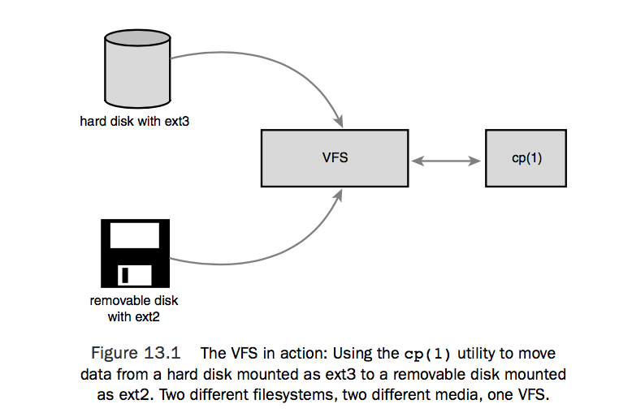
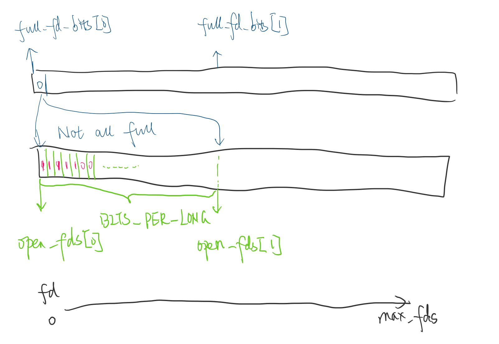

### Liux Filesystem

##### What is Linux virtual filesystem for?

- An important component of the linux's kernel

- An abstraction between user programs and the underlying filesystems of different media (disk, CD, NFS). 

  

- portable and secure layer to manage file resources

- essentially a contract that specifies the expectations of how the underlying filesystems should behave in the form of a bunch of API calls. So a FAT could actually work with VFS as long as FAT has codes and operations that realize those expectations.

##### What are some of the expectations/features of the Linux VFS then?

- all the underlying filesystems are simply identical in the eyes of the VFS 
- all mounted filesystems form a tree structure. each has a mount point in the global tree which is known as a namespace. (Update: recent Linux makes namespace per-process)
- all directories are simple files. 
- each file has a path that specifies the location of it in the filesystem, and each component of the path is called *directory entry*  (for example: /home/me/pwd, has directory entries of /, home, me, pwd). 
- meta information of a file is stored in *inode* 
- all the *inode* are tied with a *superblock* which contains the metadata of the filesystem.

##### How is the VFS implemented?

There are several important components of the VFS, which resemble a OO structures, even though the filesystem is coded in a language without OOP design built-in (C). 

1. **superblocks**  (defined in \<linux/fs.h\>)

   - represents a mounted filesystem to the VFS 
   - it specifies things such as : 
     - filesystem type,
     - max file size,
     - block size 
     - list of inodes,
     - permision
     - mount options ..
     - ….

2. inode (defined in \<linux/fs.h\>)

   - represents the meta-data of a file 
   - it could be stored in multiple ways depending on the filesystem but linux does have it on-disk (it could be in a database, or as part of the file as in other FS)
   - it specifies things such as : 
     - inode numer,
     - last access / modify time, 
     - permissions,
     - spinlock reference
     - ...

3. dentry (in \<linux/dcache.h>):

   - it is created and managed in-memeory when traversing a path => does not correspond to things on disk 

   - as mentioned, dentry means directory entry, and corresponds to a component of a paht. 

   - dentry can have a few states: 

     - **used**: this means the dentry has an associated inode AND there are some users using it

     - **unused**: the dentry has an associated inode BUT the no one is refering to it. 

       > Q: **why keep it around**
       >
       > ```
       > >
       > >A:  for caching purpose 
       >
       > ```

     - **negative**: the dentry is not associated with an inode, could be discarded. 

       > **Q: why keep it then?**
       >
       > A: to quick-fail some incorrect path resolution. So don't have to traverse the whole path 

   - dentry cache is used to perform quick look-up on a path string 

     - list of used dentries 
     - list of unused and negative dentries in LRU eviction strategy 
     - a hashtable for path to dentries lookup 

4. File object (\< linux/fs.h> )

   - represents a file that is opened by a process. NOT A REAL FILE ON THE DISK
   - created on `open` and destroyed on `close` 
   - to access file data : process —> file struct —> dentry struct —> inode struct —> data 
   - it has many common things:
     - name
     - path,
     - persmission
     - mode
     - file offset
     - owner
     - ...


##### What is a file descriptor and how is it related to all these?

- file descriptor is a handler that is given to process to access the file. 
- there is a `files` pointer in the process discriptor which points to some `file_struct` objects, which contains an array of file descriptors.


- **Definition of file_struct**:

  ```c
  struct files_struct {
    /*
     * read mostly part
     */
  	atomic_t count;
  	bool resize_in_progress;
  	wait_queue_head_t resize_wait;

  	struct fdtable __rcu *fdt;
  	struct fdtable fdtab;
    /*
     * written part on a separate cache line in SMP
     */
  	spinlock_t file_lock ____cacheline_aligned_in_smp;
  	unsigned int next_fd;
  	unsigned long close_on_exec_init[1];
  	unsigned long open_fds_init[1];
  	unsigned long full_fds_bits_init[1];
  	struct file __rcu * fd_array[NR_OPEN_DEFAULT];
  };		
  ```

- `files_struct` contains a pointer to `fdtable` which manages all the availability of the file descirptors, while the `fd_array` contains pointer to the respective file.

  ```c
  struct fdtable {
  	unsigned int max_fds;
  	struct file __rcu **fd;      /* current fd array */
  	unsigned long *close_on_exec;
  	/* pointer to memory region where each bit represents if the fd is set */
  	unsigned long *open_fds; 
      /* pointer to memory region where each bit b represents if any of [b*BITS_PER_LONG, (b+1)*BITS_PER_LONG) is set */
  	unsigned long *full_fds_bits; 
  	struct rcu_head rcu;
  };
  ```

Here is a graphical representation of the fdt: 




- **Allocating a file descriptor:** 

  getting a file descriptor in the range of `start` and `end` when a new file is open:

  ```c
  int __alloc_fd(struct files_struct *files,
  	       unsigned start, unsigned end, unsigned flags)
  ```

  ​

  1. find the next available fd (e.g., `find_next_fd`)
  2. (expand the file descriptor array when necessory)
  3. set the fd (`__set_open_fd`)

> find_next_fd

​	One of the important operations is to find the next available fd. This is done with the code below: 

```c
static unsigned int find_next_fd(struct fdtable *fdt, unsigned int start)
{
	unsigned int maxfd = fdt->max_fds; /* maxfd is the maximal value that is available for fd */
	unsigned int maxbit = maxfd / BITS_PER_LONG;  /* the size of full_fds_bits to be searched */
	unsigned int bitbit = start / BITS_PER_LONG;  /* the starting bit in full_fds_bits to be searched */
	
	/* find the next available group of fds and get the value by multiplying the size of the group */
    /* should use some other variable other than bitbit */
	bitbit = find_next_zero_bit(fdt->full_fds_bits, maxbit, bitbit) * BITS_PER_LONG;
	if (bitbit > maxfd)
		return maxfd;
	if (bitbit > start)
		start = bitbit;
    /* now search for the available fd with size bounded by maxfd, and from offset start */
	return find_next_zero_bit(fdt->open_fds, maxfd, start);
}
```


> set_open_id

​	Another operation is setting the fd as open: 

```c
static inline void __set_open_fd(unsigned int fd, struct fdtable *fdt)
{
	__set_bit(fd, fdt->open_fds); /* set the fd bit from fdt->open_fds to mark as occupied */
	
  	/* The following lines set the group which fd is in as occupied, indicating there is at least
  	 * one bit in the group fd/=BITS_PER_LONG set. */
  	fd /= BITS_PER_LONG; 
	if (!~fdt->open_fds[fd])
		__set_bit(fd, fdt->full_fds_bits);
}

```


- **Deallocating a file descriptor:**

  Both the corresponding bits in the `fdt->open_fds` and `fdt->full_fdt_bits` need to be cleared

  ```c
  static inline void __clear_open_fd(unsigned int fd, struct fdtable *fdt)
  {
  	__clear_bit(fd, fdt->open_fds);
  	__clear_bit(fd / BITS_PER_LONG, fdt->full_fds_bits);
  }
  ```

  ​

